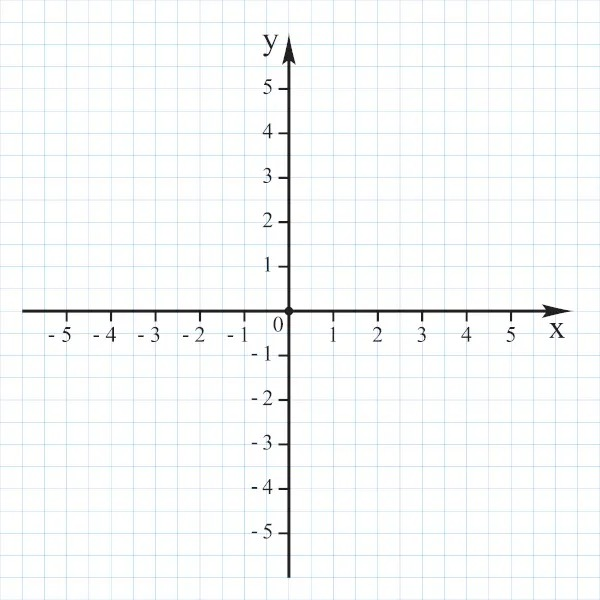

# Desafio

### Tecnologias:

* Kotlin 1.6.21
* Gradle: 7.5
* Java 17
* Spring Boot 2.7.2
* Database H2
* Swagger 1.6.9

### Endpoints

Para interações com planetas:

```
/planet
```

Para interações com a sonda espacia:

```
/spaceprobe
```

### Documentação

* [Documentação - dev](http://localhost:8080/swagger-ui/index.html)
* [Documentação - stg](https://desafio-elo7-stg.herokuapp.com/swagger-ui/index.html)
* [Documentação - prd](https://desafio-elo7-prd.herokuapp.com/swagger-ui/index.html)

### Execução

Para o ambiente de desenvolvimento informar o profile 'dev':

```
-Dspring.profiles.active=dev
```

ou

Environment variable:
```
SPRING_PROFILES_ACTIVE=dev
```

Para o ambiente de produção informar o profile 'prd':

```
-Dspring.profiles.active=prd
```

ou

Environment variable:
```
SPRING_PROFILES_ACTIVE=prd
```

### Considerações

Para um planeta de tamanho 5x5, foi considerado que no plano cartesiano ele poderá ir de -5 a 5, no eixo x e y.

Segue abaixo o gráfico exemplificando



*Obs: O projeto foi postado no ambiente gratuito do Heroku, por isso na primeira chamada
pode se ter uma lentidão na resposta devido ao provisionamento dos recursos.*